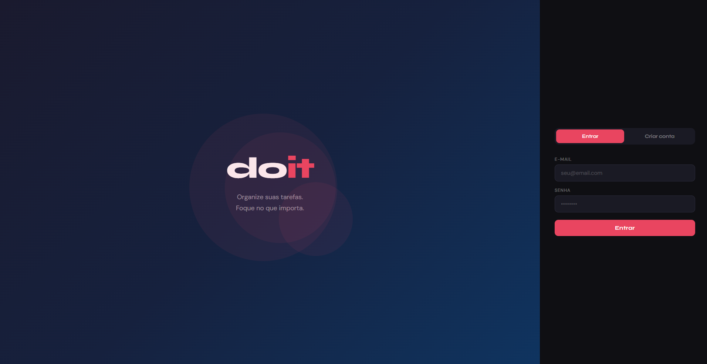
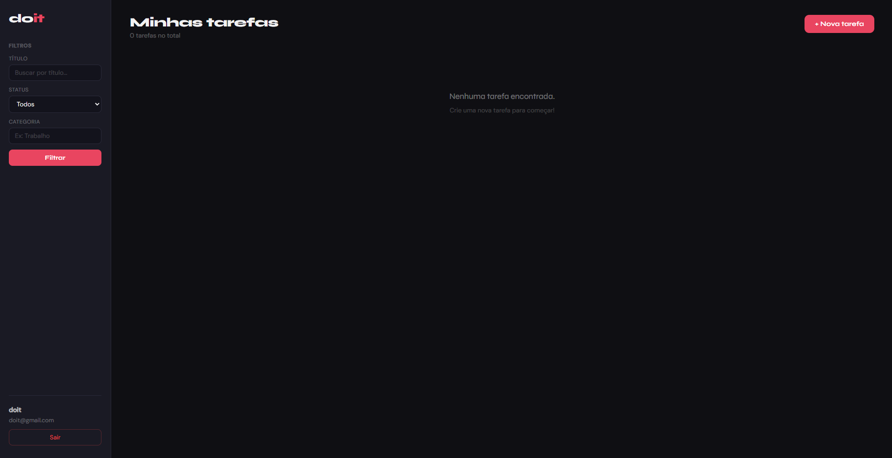

# 🖥️ DoIt

> Aplicativo desktop de gerenciamento de tarefas.

---

O **DoIt** é um aplicativo desktop completo para gerenciamento de tarefas, desenvolvido utilizando **Electron**, permitindo rodar como um software nativo no computador.

Diferente de aplicações web comuns, o DoIt:
- roda como um **executável (.exe)** no Windows
- possui **backend e frontend integrados**
- armazena dados localmente
- funciona de forma independente do navegador

---

## Tecnologias utilizadas

### 🧠 Backend
- Node.js
- Express
- SQLite
- Knex
- JWT (autenticação)
- Bcrypt (criptografia de senha)

### 🎨 Frontend
- React
- Vite

### 🖥️ Desktop
- Electron
- Electron Builder

---

## 📸 Demonstração





### Funcionalidades:

- Cadastro de usuários
- Autenticação com JWT
- Criação de tarefas
- Edição de tarefas
- Marcar como concluída
- Remoção de tarefas

## ⚙️ Instalação

Clone o repositório:

```bash
git clone https://github.com/gAmoorim/doIt.git
```
Instale as dependências:
```bash
npm install
```
Instale também o frontend:
```bash
cd frontend
npm install
cd ..
```
Rodar em modo desenvolvimento e build do executável
```bash
npm run dev & npm run build
```