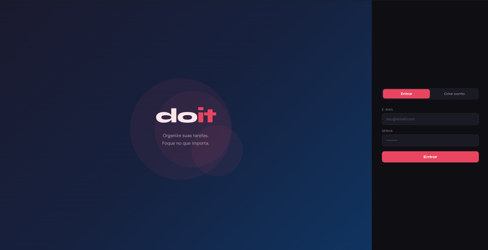
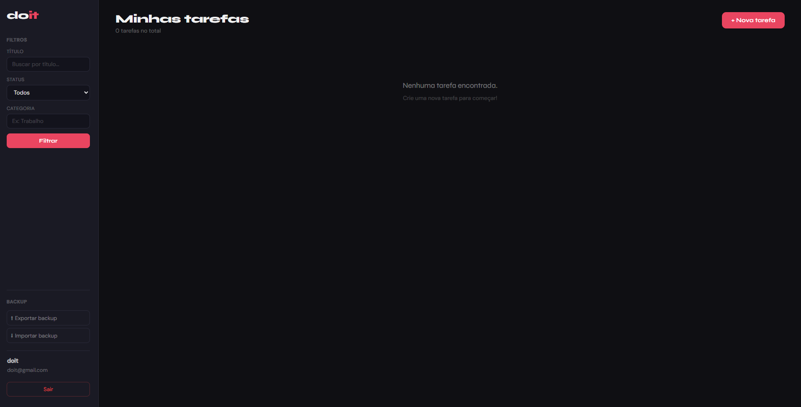
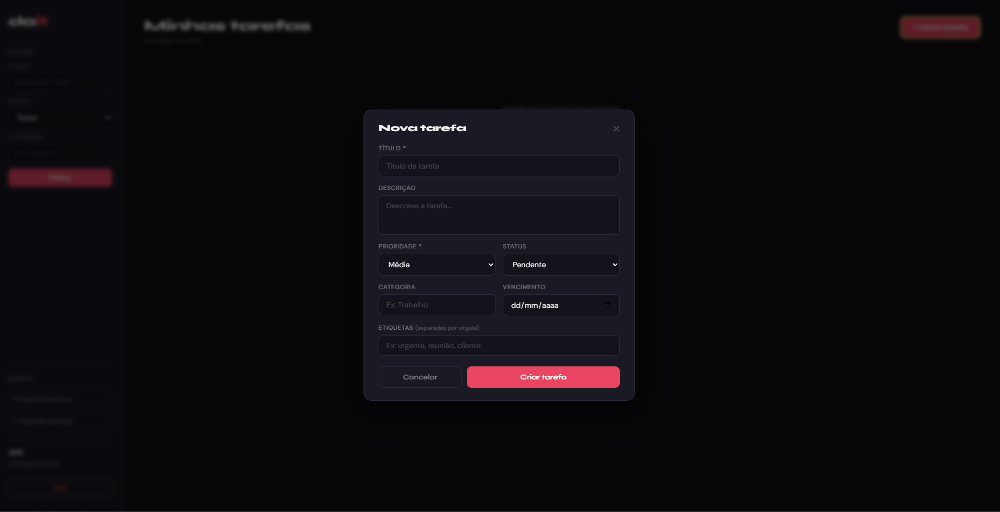

# DoIt

Aplicativo desktop de gerenciamento de tarefas, construído com Electron, React e Node.js. Totalmente local — sem necessidade de servidor externo ou conexão com a internet.

## 📋 Sobre o projeto

O DoIt é um to-do list completo no formato de aplicativo desktop instalável no Windows. O projeto nasceu como uma API web e evoluiu para uma aplicação Electron, unindo um backend Node.js/Express com um frontend React moderno, tudo empacotado em um único executável.

## ✨ Funcionalidades

- 🔐 **Autenticação completa** — cadastro e login com JWT e senhas criptografadas (bcrypt)
- 🔄 **Sessão persistente** — permanece logado por 5 dias entre uma abertura e outra do app
- ✅ **Gerenciamento de tarefas** — criação, edição, exclusão e listagem
- 🏷️ **Organização avançada** — status (pendente, em andamento, concluída), prioridade (alta, média, baixa), categoria, etiquetas e data de vencimento
- 🔍 **Filtros** — busca por título, status e categoria
- 📊 **Ordenação inteligente** — tarefas organizadas por prioridade dentro de cada status
- 👤 **Gerenciamento de conta** — edição de nome, e-mail e senha, com opção de exclusão de conta
- 💾 **Backup local** — exportação e importação do banco de dados para resguardar seus dados
- 🎨 **Interface moderna** — design dark mode com identidade visual própria

## 🛠️ Tecnologias

**Frontend**
- React + Vite
- CSS Modules

**Backend**
- Node.js + Express
- Knex.js (query builder)
- SQLite

**Desktop**
- Electron
- electron-builder (empacotamento)
- electron-store (persistência de sessão)

**Autenticação**
- JSON Web Token (JWT)
- bcrypt

## 📸 Capturas de tela

 -->
 -->
 -->

## 🚀 Como rodar o projeto

### Instalação

```bash
# clone o repositório
git clone https://github.com/gAmoorim/doIt.git
cd doIt

# instale as dependências da raiz (backend + Electron)
npm install

# instale as dependências do frontend
cd frontend
npm install
cd ..
```

### Configuração

Crie um arquivo `.env` na raiz do projeto com o seguinte conteúdo:

```dotenv
PORT=3000
JWT_PWD=sua_chave_secreta_aqui
```

### Rodando em modo desenvolvimento

```bash
npm run dev
```

Isso vai iniciar o servidor Vite e abrir a janela do Electron automaticamente.

### Gerando o executável

```bash
npm run build
```

O instalador `.exe` será gerado na pasta `dist/`.

## 📁 Estrutura do projeto

```
doit/
├── backend/
│   ├── server.js
│   └── src/
│       ├── controllers/
│       ├── database/
│       ├── routers/
│       └── utils/
├── electron/
│   └── preload.js
├── frontend/
│   └── src/
│       ├── components/
│       ├── pages/
│       └── services/
├── main.js
└── package.json
```

## 💾 Armazenamento de dados

O banco de dados SQLite é armazenado localmente em:

```
%APPDATA%\DoIt\data\todolist.db
```

Os dados não são apagados ao desinstalar o aplicativo, e podem ser exportados/importados manualmente através da função de backup disponível na barra lateral do app.

## 📄 Licença

Este projeto está sob a licença ISC.

---

Desenvolvido como projeto de portfólio para prática de desenvolvimento fullstack e aplicações desktop.